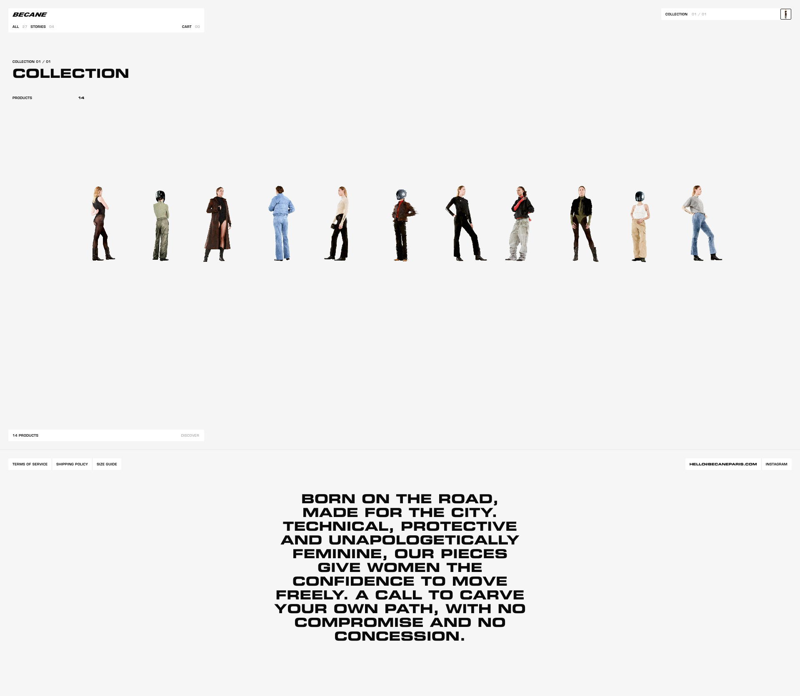

# Bécane Paris UI 분석

> 참고 URL: https://www.becaneparis.com/

---

## 1. 사이트 개요

- **브랜드**: Bécane Paris
- **유형**: 패션 이커머스 (Shopify 기반)
- **컨셉**: 바이커/모터사이클 + 여성 패션
- **디자인 스타일**: 미니멀리즘, 하이엔드 에디토리얼

---

## 2. 페이지 구성

| 페이지 | 설명 |
|--------|------|
| 메인 (컬렉션) | 상품 컬렉션 쇼케이스 |
| All (27개 상품) | 전체 상품 목록 |
| Stories (4개) | 브랜드 스토리/룩북 |
| 개별 Look 페이지 | 14가지 테마별 상세 (The Siren, The Kiddo, The Rebel 등) |
| 정책 페이지 | 이용약관, 배송정책, 사이즈 가이드 |

---

## 3. 메인 페이지 레이아웃

```
┌─────────────────────────────────────────────────────────────────┐
│  BECANE          ALL 27  STORIES 04      CART 00    │ COLLECTION 01/01 │
├─────────────────────────────────────────────────────────────────┤
│  COLLECTION 01 / 01                                             │
│  COLLECTION                                                     │
│  PRODUCTS  14                                                   │
├─────────────────────────────────────────────────────────────────┤
│                                                                 │
│    👤 👤 👤 👤 👤 👤 👤 👤 👤 👤 👤                              │
│    (11명의 모델이 옆모습으로 일렬 배치 - Chronophotography)       │
│                                                                 │
├─────────────────────────────────────────────────────────────────┤
│  14 PRODUCTS                                        DISCOVER    │
└─────────────────────────────────────────────────────────────────┘
```

---

## 4. UI 컴포넌트 상세

### 4.1 헤더

| 위치 | 요소 | 스타일 |
|------|------|--------|
| 좌측 | BECANE 로고 | Bold, 블랙, 대문자 |
| 중앙 | ALL 27 / STORIES 04 | 텍스트 + 회색 숫자 |
| 우측 | CART 00 | 장바구니 + 수량 |
| 극우측 | COLLECTION 01/01 + 아이콘 | 작은 텍스트, 세퍼레이터 |

### 4.2 메인 섹션

| 요소 | 스타일 |
|------|--------|
| 서브타이틀 | "COLLECTION 01 / 01" - 작은 대문자 |
| 메인 타이틀 | "COLLECTION" - 매우 큰 Bold 타이포그래피 |
| 상품 카운트 | "PRODUCTS 14" - 좌측 정렬 |

### 4.3 히어로 비주얼

- **스타일**: Chronophotography (연속 동작 사진 기법)
- **구성**: 11명 모델이 옆모습(프로필)으로 수평 일렬 배치
- **특징**: 일부 모델 헬멧 착용 (브랜드 아이덴티티)
- **배경**: 순백색

### 4.4 하단 플로팅 바

| 좌측 | 우측 |
|------|------|
| "14 PRODUCTS" | "DISCOVER" 버튼 |

---

## 5. 디자인 시스템

### 5.1 컬러 팔레트

| 용도 | 색상 |
|------|------|
| 배경 | #FFFFFF (순백) |
| 주 텍스트 | #000000 (블랙) |
| 보조 텍스트 | #888888 (그레이) |
| 의상 톤 | 올리브, 브라운, 데님블루, 블랙, 베이지, 크림 |

### 5.2 타이포그래피

- **폰트**: Geometric Sans-serif (추정: Monument Extended 또는 유사)
- **메인 타이틀**: Extra Bold, 대문자
- **네비게이션**: Regular, 대문자
- **숫자**: Light 또는 Regular, 회색

### 5.3 레이아웃 특성

- 극도의 미니멀리즘
- 풍부한 여백 (Whitespace)
- 좌측 정렬 기반
- 그리드: 전체 너비 활용

---

## 6. 인터랙션 요소

- 모델 이미지 호버 시 동영상 재생 (추정)
- DISCOVER 버튼 클릭 시 상품 목록 이동
- 각 모델 클릭 시 개별 Look 페이지 이동
- 스크롤 시 플로팅 바 유지

---

## 7. 기술 스택

- **플랫폼**: Shopify
- **통화**: EUR
- **연락처**: hello@becaneparis.com
- **소셜**: Instagram

---

## 8. Stitch 생성용 프롬프트 (Draft)

```
Create a minimalist fashion e-commerce landing page with:

Header:
- Bold logo "BECANE" on the left
- Navigation: "ALL 27", "STORIES 04", "CART 00"
- Right side: "COLLECTION 01/01" with small icon

Main Section:
- Small subtitle "COLLECTION 01 / 01"
- Large bold title "COLLECTION"
- "PRODUCTS 14" counter

Hero Visual:
- Horizontal row of 11 fashion models in side profile view
- Models arranged in a line facing right (chronophotography style)
- Pure white background
- Models wearing neutral toned clothing (olive, brown, denim, black, beige)

Bottom Floating Bar:
- Left: "14 PRODUCTS"
- Right: "DISCOVER" button

Design:
- Pure white background
- Black typography
- Geometric sans-serif font
- Extreme minimalism with lots of whitespace
- High-end editorial fashion aesthetic
```

---

## 9. 참고 스크린샷


